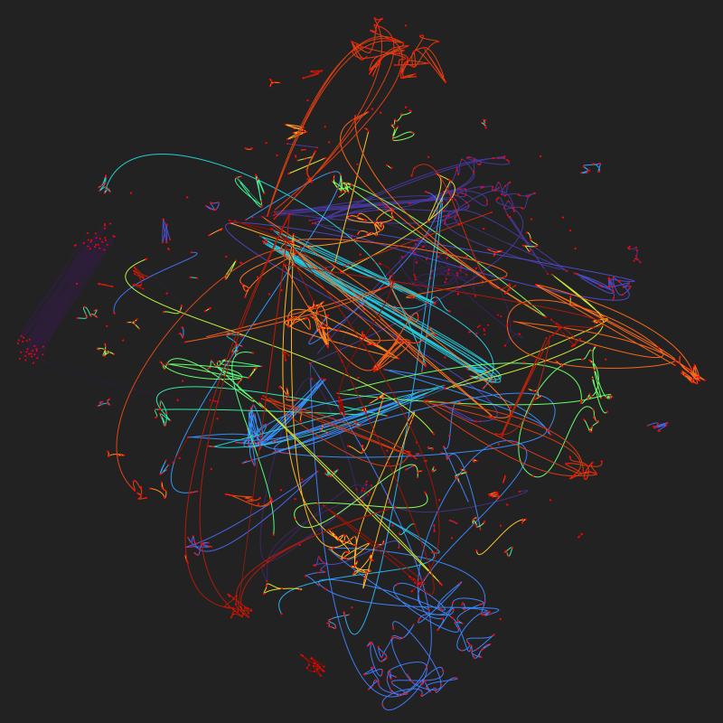

# chat-contours

Visualize the flow of chatgpt conversations from their embeddings. Messages with similar embeddings should appear close to each other etc.

The [CollectiveCognition sample chat dataset](https://huggingface.co/datasets/CollectiveCognition/chats-data-2023-09-27/tree/main) (200 ChatGPT/bing conversations).



## Run

```
pnpm install
pnpm run dev
```

## Method

- Calculate the embedding of each message (so quite coarse embeddings) in each conversation
- Use t-SNE to reduce the dimension of the set of all message embeddings down to 2d (from 1538d)
- Plot each embedding as a dot on a 2d plane
- Connect up each conversation with a line and give it a unique color

## Links

- https://huggingface.co/datasets/CollectiveCognition/chats-data-2023-09-27/tree/main
